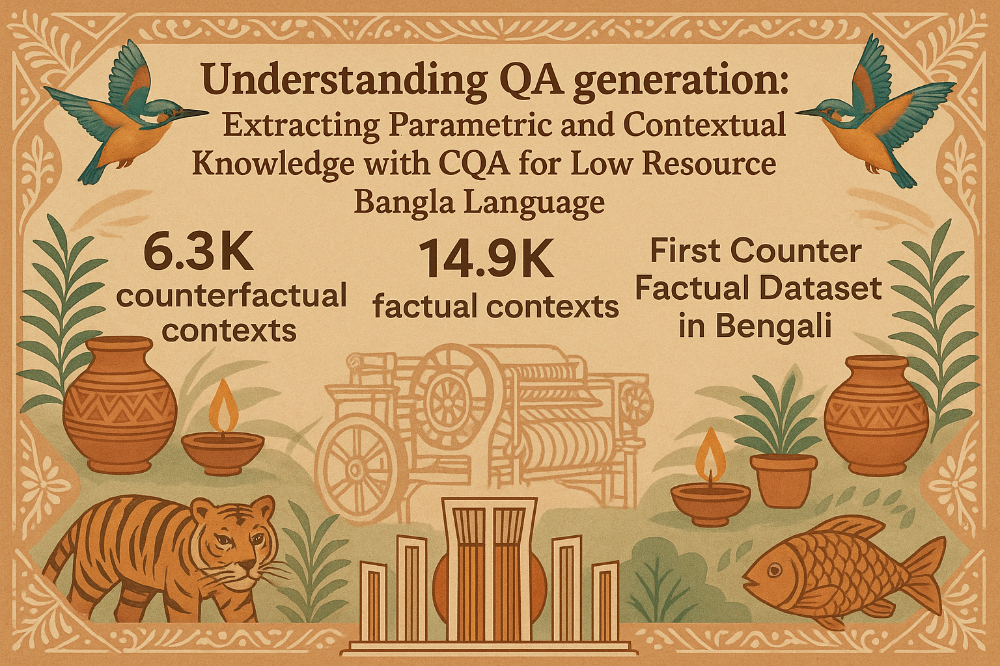

# Understanding QA Generation: Extracting Parametric and Contextual Knowledge with CQA for Low-Resource Bangla Language

This repository contains the codebase for our research on question answering (QA) in low-resource Bangla. The code is organized into multiple components, each corresponding to a stage in our pipeline: model inference, answer extraction, and output evaluation.

## Repository Structure

### 1. Model Output Generation

This module facilitates the execution of various language models over our curated dataset. The outputs from these models serve as the base for further answer extraction and evaluation.

* **Folder:** `Notebooks for running the models`

  * Contains Jupyter notebooks and scripts for running inference using different LLMs like Mistral 3 Small 24B, DeepSeek 32B, QwQ 32B, Llama 3.3 70B.
  * Includes configuration files and setup instructions for each model used.

### 2. Answer Extraction

* **Folder:** `Extracting Target Answers from model outputs`

  * Scripts in this section are responsible for parsing model outputs to extract target parametric and contextual answers.
  * These extractions are aligned with ground truth labels for subsequent evaluation.

### 3. Output Evaluation

* **Folder:** `Gemini Evaluation`

  * This folder contains scripts that utilize the Gemini model for automated evaluation of generated outputs.
  * **Extractor Script:** Compares generated answers with target answers on a granular level.
  * **Evaluator Script:** Uses the results from the Extractor and computes an average similarity score for final evaluation.

* **Folder:** `GPT Evaluation`

  * This folder contains scripts that utilize GPT models for automated evaluation of generated outputs.
  * **Evaluation Scripts:** Scripts for evaluating model outputs using GPT-based assessment methods.
  * **Score Calculation:** Tools for calculating mean scores and aggregating evaluation metrics across different models.

## Getting Started

Each folder includes detailed scripts, configurations, and usage instructions. We encourage readers and reviewers to explore individual modules for a deeper understanding of the methodology and implementation.

---
